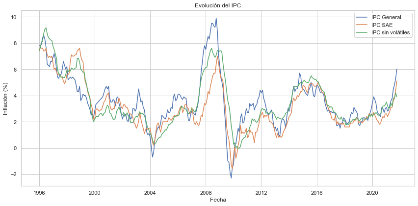

📊 Análisis de la Inflación Anual en Bolivia
Este proyecto consiste en un dashboard interactivo y un análisis en PDF sobre la inflación anual en Bolivia, centrado en el Índice de Precios al Consumidor (IPC General).

🧰 Herramientas utilizadas
Python

Pandas

Matplotlib

Seaborn

Jupyter Notebook

ReportLab (para generar PDF)

📁 Contenido del repositorio
BC Inflacion anual.csv: Datos de inflación anual proporcionados por el Banco Central de Bolivia.

analisis_inflacion.ipynb: Análisis exploratorio y generación de gráficos.

README.md: Este archivo con la descripción del proyecto.

游늷 쯈u칠 contiene el análisis?
Gráfico de la inflación anual desde el año 1996 hasta 2021.

Detección de los años con mayor y menor inflación.

